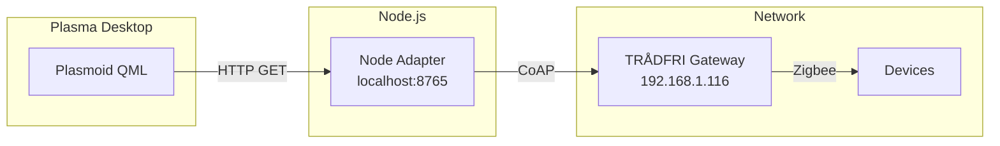

# Architecture

## System Overview

Plasma Domotik is a 3-tier system:

```
┌─────────────────────────────────────────────────────────────────────────┐
│                    Plasma Desktop                       │
│  ┌─────────────────────────────────────────┐  │
│  │           Plasmoid (main.qml)             │  │
│  │  - Widget UI in panel/desktop              │  │
│  │  - Shows device list                    │  │
│  │  - Toggle switches                   │  │
│  │  - HTTP requests to localhost:8765        │  │
│  └─────────────────────────────────────────┘  │
└─────────────────────────────────────────────────┘
                         │
                         │ HTTP (XMLHttpRequest)
                         ▼
┌─────────────────────────────────────────────────────────────────────────┐
│              Node Adapter (port 8765)                 │
│  ┌─────────────────────────────────────────┐  │
│  │  - HTTP server (express-like)             │  │
│  │  - REST API endpoints                 │  │
│  │  - deviceCache (Map)                │  │
│  │  - TradfriClient connection         │  │
│  └─────────────────────────────────────────┘  │
└─────────────────────────────────────────────────┘
                         │
                         │ CoAP (node-tradfri-client)
                         ▼
┌─────────────────────────────────────────────────────────────────────────┐
│                  Gateway TRÅDFRI                    │
│  IP: 192.168.1.116                                  │
│  Security Code: <your security code>                  │
│                                                      │
│  └─ Devices:                                         │
│     - Bathroom (65544)                                │
│     - Bed side (65545)                                 │
│     - Main ceiling (65553)                            │
│     - Bed ceiling (65555)                            │
│     - Outlet1 (65556)                                │
│     - TRADFRI outlet 2 (65557)                        │
└─────────────────────────────────────────────────┘
```

## Component Details

### Plasmoid (QML)

- **File**: `plasmoid/package/contents/ui/main.qml`
- **Root**: `PlasmoidItem`
- **Type**: Plasma 6 widget

**Properties**:
- `devices`: Array of device objects
- `loading`: Boolean loading state
- `connected`: Boolean connection state
- `statusText`: Status message
- `gatewayHost`: Gateway IP address
- `securityCode`: Gateway security code

**Functions**:
- `httpGet(path, callback)`: Make HTTP GET request
- `refreshDevices()`: Fetch device list
- `togglePower(deviceId, state)`: Toggle device power

### Node Adapter (Node.js)

- **File**: `backend/service/tradfri_node_adapter.mjs`
- **Port**: 8765

**API Endpoints**:

| Endpoint | Method | Description |
|----------|--------|-----------|
| `/connect` | GET | Connect to gateway |
| `/devices` | GET | Get device list |
| `/power` | GET | Set device power |
| `/brightness` | GET | Set brightness |

### Data Flow

1. **Startup**: Plasmoid → HTTP /connect → Node → CoAP → Gateway
2. **Get Devices**: Plasmoid → HTTP /devices → Node → Cache
3. **Toggle**: Plasmoid → HTTP /power → Node → operateLight() → Gateway → Device

## File Locations

| Component | Location |
|-----------|----------|
| Plasmoid | `~/.local/share/plasma/plasmoids/io.github.davvore33.PlasmaDomotik/` |
| Node Adapter | `~/.local/share/plasma-domotik/backend/service/` |
| Service | `~/.config/systemd/user/plasma-domotik-adapter.service` |

## Diagram

