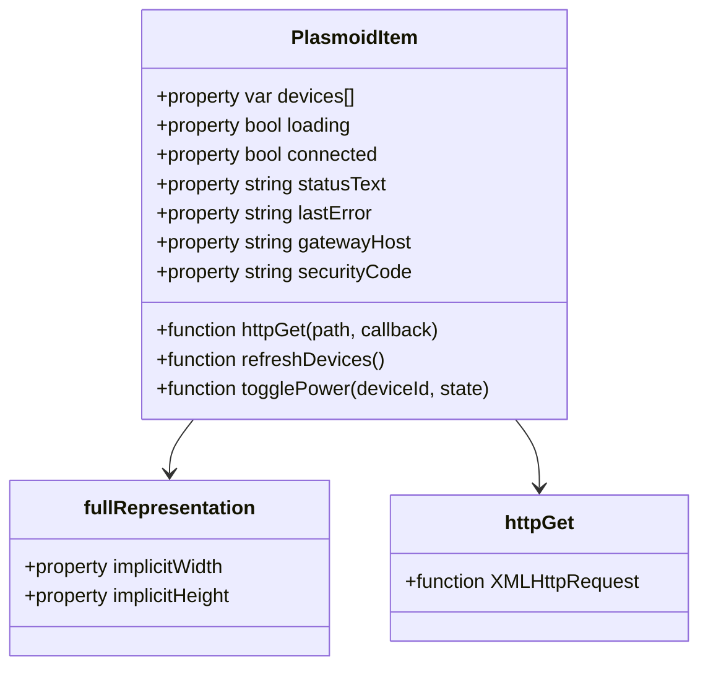
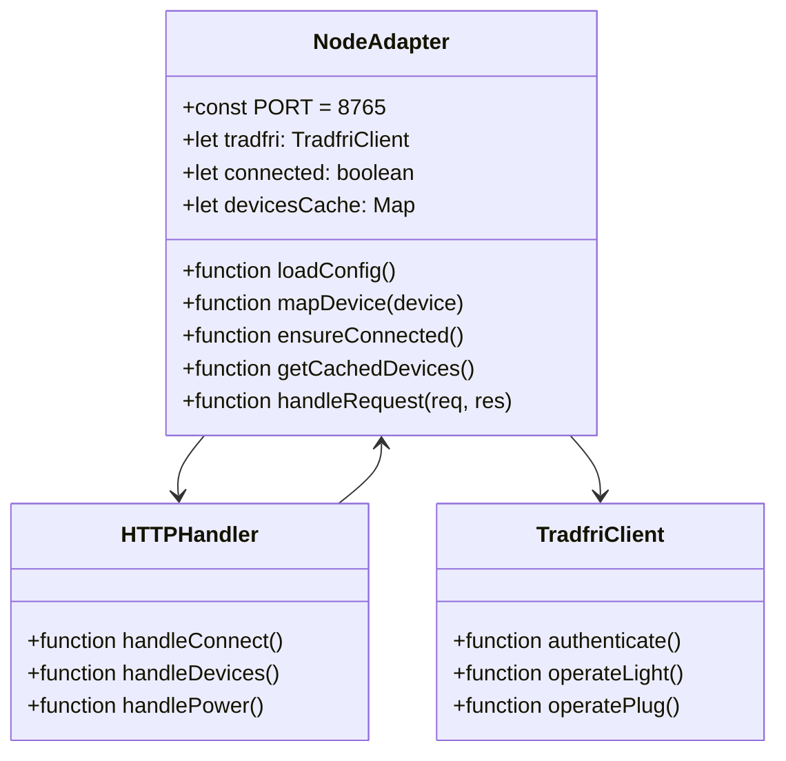
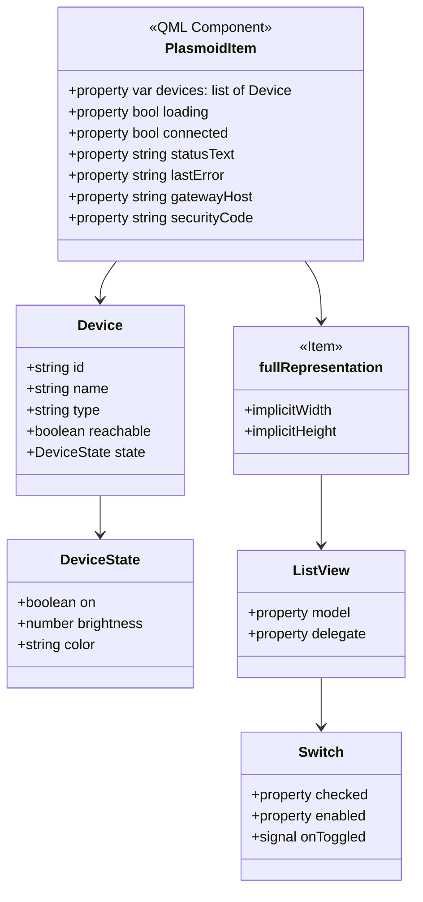
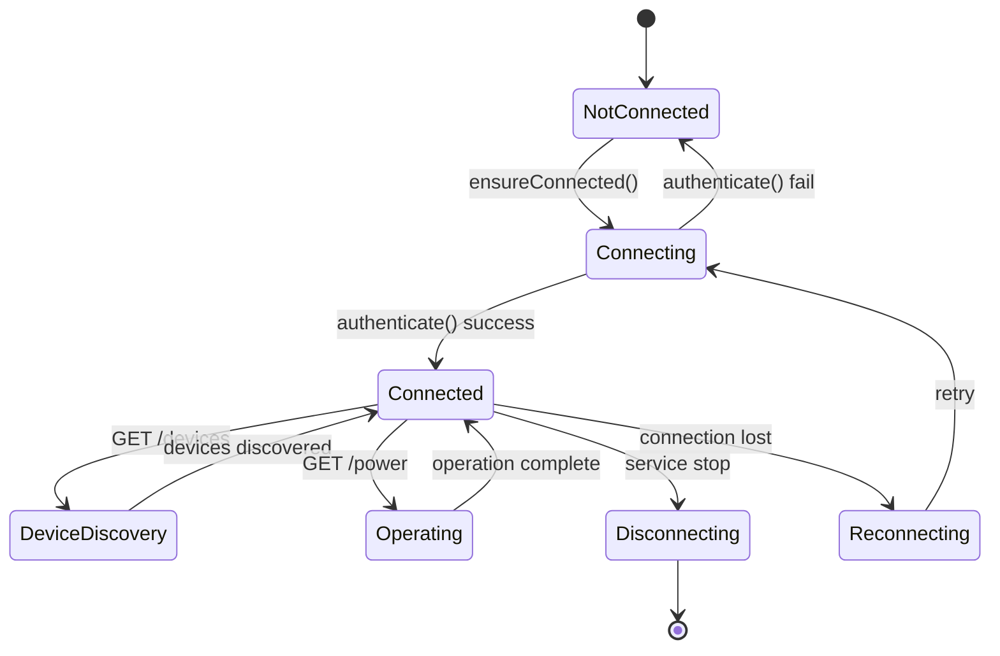
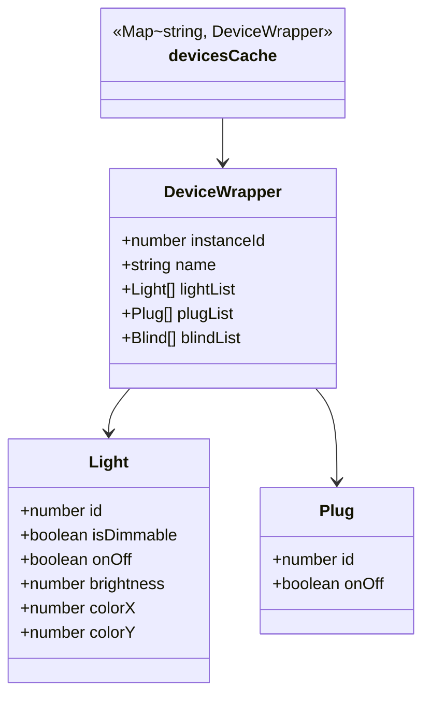
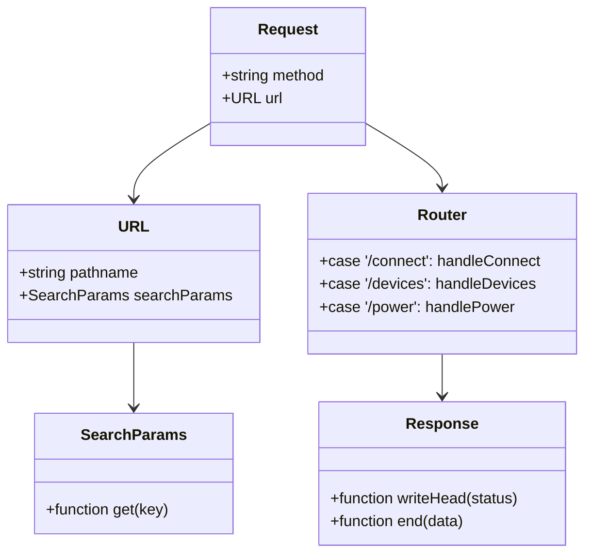
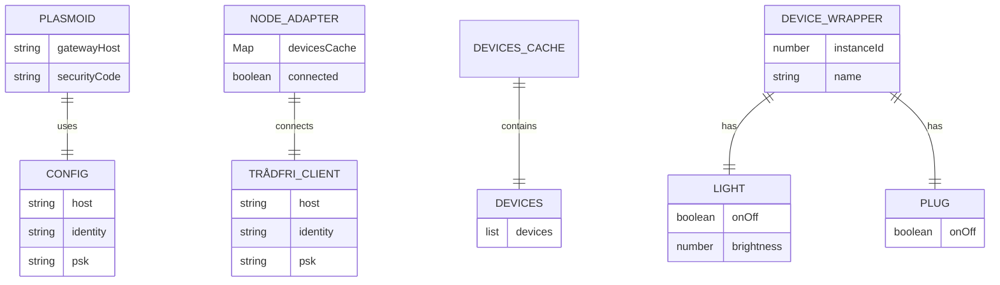

# Class Diagrams

## 1. Main Components





---

## 2. Plasmoid Properties



---

## 3. Node Adapter State Machine



---

## 4. Devices Cache



---

## 5. HTTP Request Flow



---

## 6. API Endpoints

```mermaid
classDiagram
    class NodeAdapter {
        +handleRequest(req, res)
    }
    
    class ConnectHandler {
        +host: string
        +securityCode: string
        +returns: {connected, identity, psk}
    }
    
    class DevicesHandler {
        +ensureConnected()
        +waitForInitialDiscovery()
        +getCachedDevices()
        +returns: Device[]
    }
    
    class PowerHandler {
        +deviceId: string
        +state: boolean
        +operateLight()/operatePlug()
        +returns: {success}
    }
    
    class BrightnessHandler {
        +deviceId: string
        +value: number
        +setBrightness()
        +returns: {success}
    }
    
    NodeAdapter --> ConnectHandler
    NodeAdapter --> DevicesHandler
    NodeAdapter --> PowerHandler
    NodeAdapter --> BrightnessHandler
```

---

## 7. Data Models



---

## 8. Relationships

```mermaid
flowchart LR
    A[Plasmoid<br/>main.qml] -->|creates| B[HTTP Request]
    B -->|sends to| C[localhost:8765]
    C -->|Node Adapter<br/>tradfri_node_adapter.mjs]
    C -->|creates| D[TradfriClient]
    D -->|connects to| E[TRÅDFRI Gateway]
    E -->|controls| F[Zigbee Devices]
    
    subgraph "Plasma Desktop"
    A
    B
    end
    
    subgraph "Node.js Runtime"
    C
    D
    end
    
    subgraph "Network"
    E
    F
    end
```