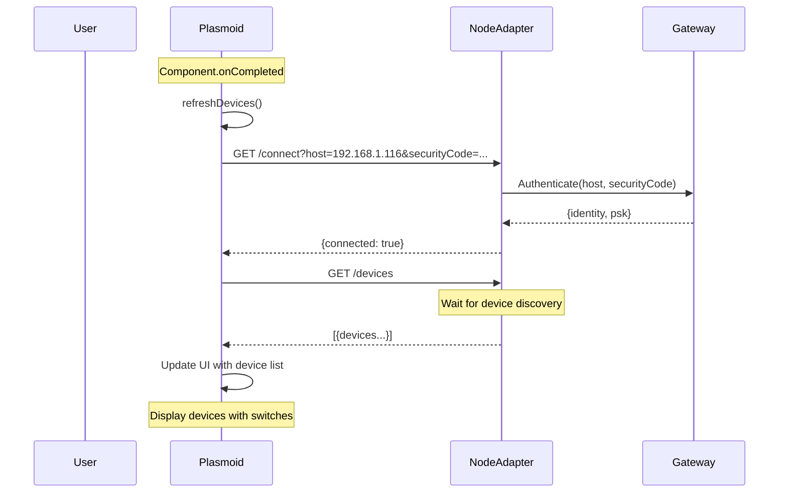
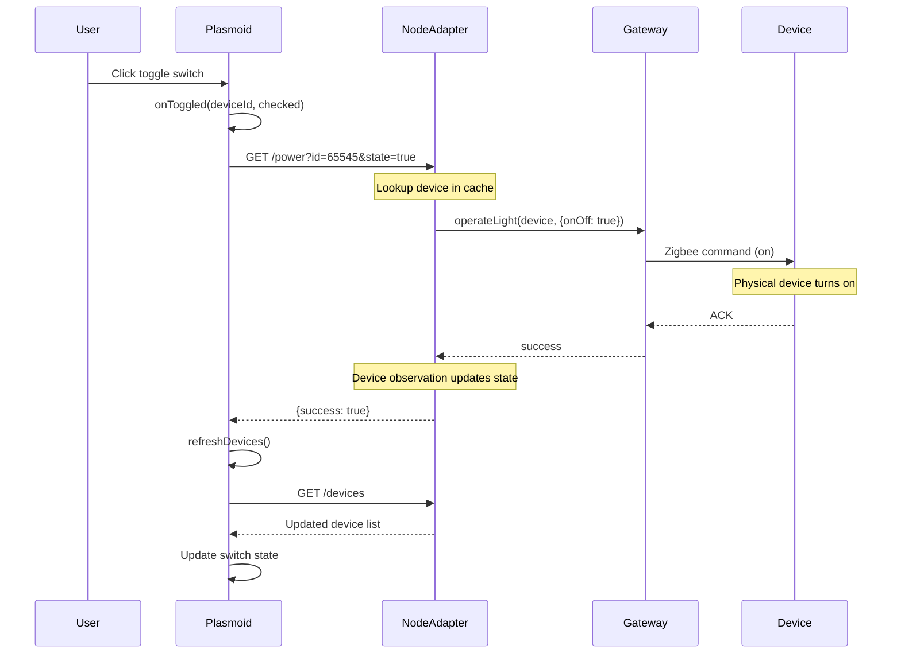
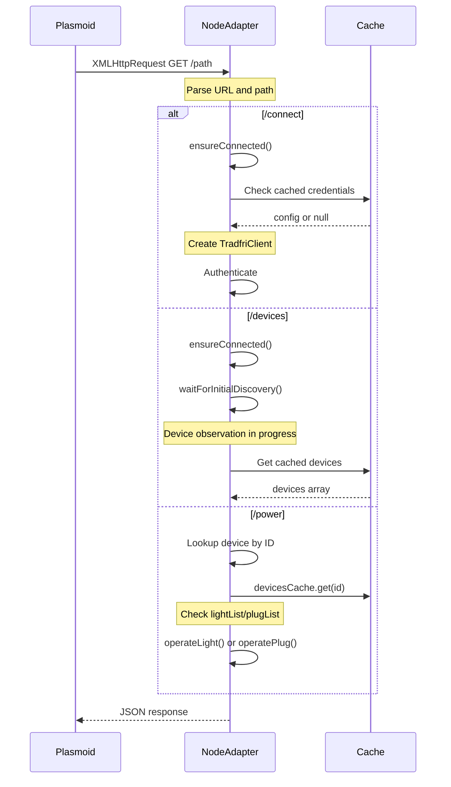
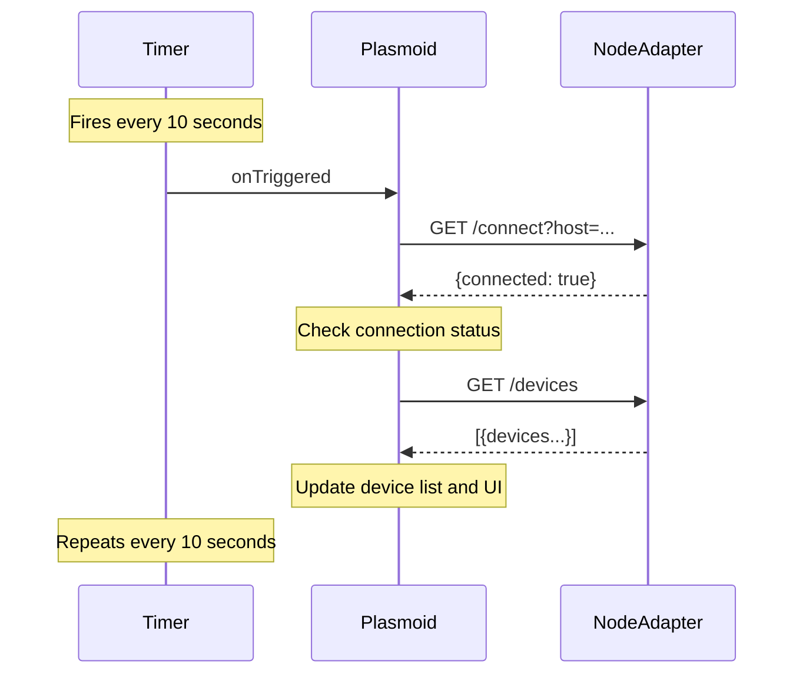
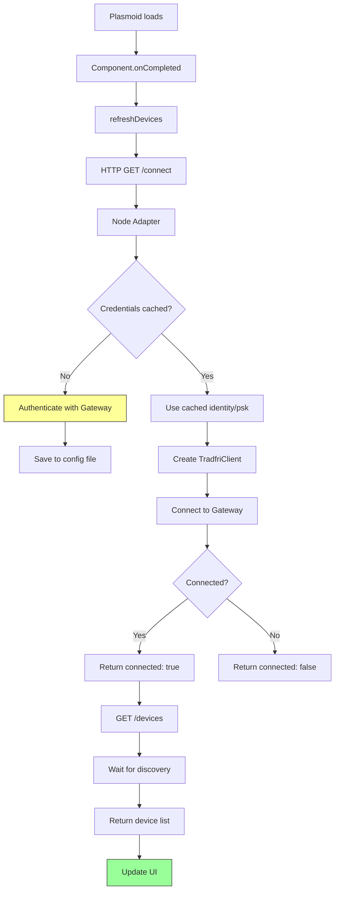

# Flow Diagrams

## 1. Application Startup



## 2. Toggle Device Power



## 3. HTTP Request Flow



## 4. Device List Update Timer



## 5. System Flow Diagram

```mermaid
flowchart TD
    A[User clicks switch] --> B[onToggled event]
    
    B --> C[XMLHttpRequest]
    C --> D[localhost:8765]
    
    D --> E{Device in cache?}
    E -->|Yes| F[operateLight/operatePlug]
    E -->|No| G[Return 404]
    
    F --> H[CoAP to Gateway]
    H --> I[Zigbee to Device]
    I --> J[Device responds]
    J --> K[ACK to Gateway]
    K --> F
    
    F --> L[{success: true}]
    L --> M[refreshDevices]
    
    M --> N[GET /devices]
    N --> O[Update UI]
    
    style A fill:#f9f,stroke:#333
    style I fill:#ff9,stroke:#333
    style O fill:#9f9,stroke:#333
```

## 6. Connection Flow

